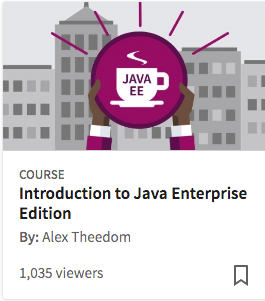

```
Roberto Nogueira  
BSd EE, MSd CE
Solution Integrator Experienced - Certified by Ericsson
```
# LinkedIn project



**About**

Learn everything you need to about the subject of this `LinkedIn` project.

[Homepage](https://www.linkedin.com/learning/introduction-to-java-enterprise-edition)

## Topics
```
1. Java Enterprise Edition
[x] Java EE history, present, and future 5m 50s
[x] Introduction to the demo application 5m 21s

2. IDE and Development Environment Intro
[x] Introduction to the IDE 4m 21s
[x] Introduction to the server 1m 45s
[x] Basic architecture 5m 24s

3. JavaServer Faces (JSF)
[x] JSF introduction 6m 4s
[x] JSF in practice, part 1 4m 42s
[x] JSF in practice, part 2 1m 48s
[x] Challenge 1m 13s
[x] Solution 1m 51s

4. Context and Dependency Injection (CDI)
[x] CDI introduction 5m 31s
[x] CDI in practice 4m 43s
[x] Challenge 40s
[x] Solution 3m 16s

5. JavaServer Pages (JSP) and Expression Language (EL)
[x] JSP EL introduction 4m 15s
[x] JSP EL in practice 2m 15s

6. Enterprise Java Beans (EJB) 3
[x] EJB introduction 6m 9s
[x] EJB in practice 5m 0s

7. Java Messaging Service (JMS)
[ ] JMS introduction 4m 3s
[ ] JMS front end 2m 16s
[ ] JMS in practice: Senders and receivers 2m 46s
[ ] JMS in practice: Fire observe 1m 20s
[ ] Challenge 36s
[ ] Solution 2m 32s

8. Java Persistence API (JPA)
[ ] JPA introduction 4m 19s
[ ] JPA in practice: Entity 3m 33s
[ ] JPA in practice: Repository 4m 35s

9. Bean Validation
[ ] Bean Validation introduction 2m 24s
[ ] Bean Validation in practice 1m 42s

10. Java API for RESTful Web Services (JAX-RS) API
[ ] JAX-RS introduction 4m 19s
[ ] JAX-RS in practice, part 1 2m 46s
[ ] JAX-RS in practice, part 2 1m 54s

11. WebSocket API
[ ] WebSocket introduction 2m 50s
[ ] WebSocket in practice 2m 9s

12. JSON Processing API
[ ] JSON Processing introduction 1m 59s
[ ] JSON Processing in practice 1m 2s

13. Batch Processing API
[ ] Batch introduction 3m 55s

14. Java 8 with Java EE 7
[ ] Java 8 introduction 3m 2s
[ ] Java 8 and Java EE 7 in practice 3m 38s
[ ] Java 8 and Java EE 7: Parallel streams 2m 21s

Conclusion
[ ] Next steps
```
